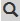
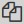
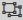
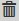
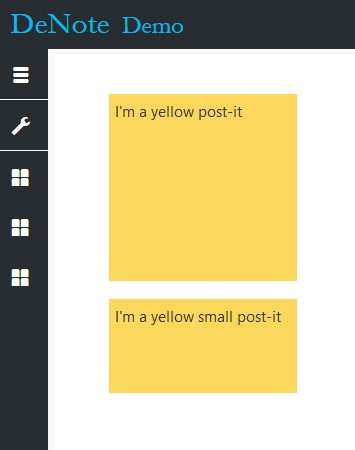
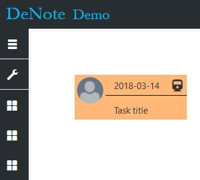
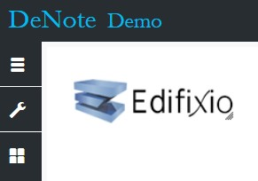
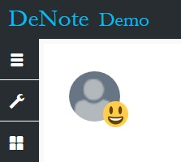
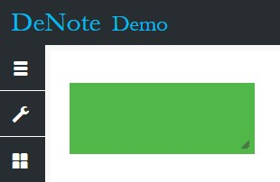
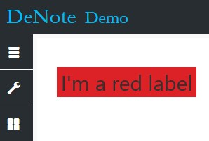

# Boards
In this section, we will focus on the actions users can perform on stickies. It requires a role of User or Admin.

## Create a sticky
To create a sticky, click on the cross button at the bottom right corner of a board. Select the type of ticket you want to create and fill the required information. The ticket will appear at the top left corner of the board.

## Action on a sticky
There are several actions you can perform on a sticky. Most of them are accessible using the right bar displayed on mouse over.

### Move
To move a sticky, just left click anywhere on the sticky and move your mouse. 

### Details
Some fields of a sticky are not necessary display on the board. To see those extra fields, you must display the details by clicking button .

### Lock
This action is accessible only for project’s administrators. This will allow them to lock a sticky on the board by clicking button . A locked sticky can’t be updated or moved. 

### Update
You can update sticky information by clicking button . This will display popup where you can fill up fields.

### Copy (duplicate)
You can duplicate an existing sticky by clicking button . This will make an exact copy of a sticky.

### Put in background
You can mange different level of depth for a sticky. When you move a sticky, it is automatically put on the front of the others. You can click on button  to put the sticky in background.

### Delete
You can delete a sticky by clicking button . This action can’t be undo.

## List of sticky types
### Post-It
It is an element aims to represent a real-life post-It. User can set the background color, the text and a size (small or normal). 

### Task
A task is a work item assigned to a user. In deNote you can set a title, due date, priority, assignment, content and a background color. The content is displayed only when you open the detail popup.

### Image
Single image that user can upload from his computer. 

### Mood
Mood sticky is a pictorial representation of the user’s mood. It displays the user’s logo with a smiley icon on the bottom right.

### Rectangle
It is just a shape representing a rectangle with a background color. No text can be added. You can set the width and height though.

### Label
Label is a text area. User can set the size of the text and the background color.

### Jira factory
Jira factory allows user to query a Jira repository using a REST request. User must set the URL of the JIRA, a REST request and a login to connect to Jira. This will create a sticky on the board. To get or update tickets from JIRA, user must click on the refresh button . User’s password is required to connect to the JIRA and get the tickets. They pop over the factory sticky and can’t be updated. 

Besides, user can get a single ticket by clicking button . 

User can archive a ticket using a functionality called Warp zone. The warp zone is located at the bottom right corner with this image . To put a ticket into the warp zone, just move it over the image. It will disappear, but it is not removed until the factory is refreshed. To restore it and display it again on the board, you must search it using the search bar.
