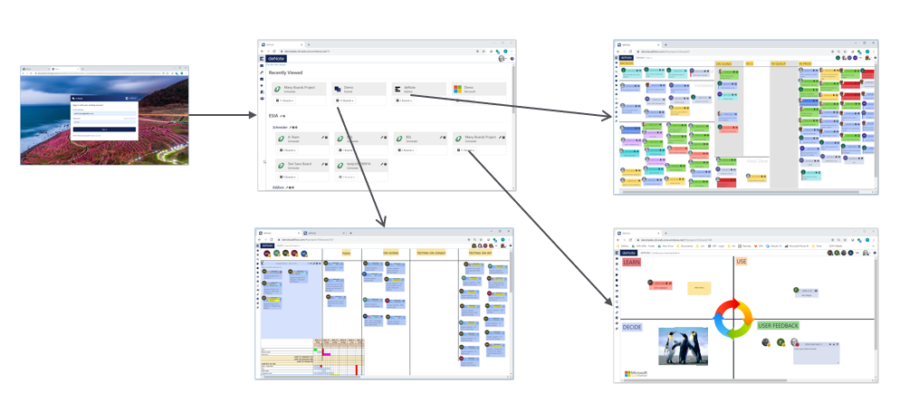

Welcome to the open source documentation of deNote application by Edifixio.

# Getting Started
First time using deNote, you can first read the [context and objective](Context-and-objectives) of this application or directly jump in on how to use [deNote boards](Board)!
* [Create my user](new-user)
* [First step as board user](new-project-user)
* [First step as board admin](new-project-admin)
* [First step as billing unit admin](new-bu-admin)

# General presentation
deNote is an online white board application, real time responsive, highly customizable, build as an information agregator that can handle multiple projects with muliple boards.

# Become a deNote user
To use denote you have to purchase a subscription, please contact us to see the details.

# Offer level
Multiple offer level are available depending of your need and your budget.
Check out our [Offer details page](Offer-Detail).

# Using deNote

## Roles

Check out our [Role details page](Roles).

## Organization

Check out our [denote organization page](Organization).

## Common features

Check out our [common feature page](Common-Features).

## Sticky types

Check out our [sticky type page](Sticky-Types).

# FAQ

Check out our [FAQ page](FAQ).

## Contributing to the documentation
deNote documentation is a public project, you can fork and propose your modification.

---

