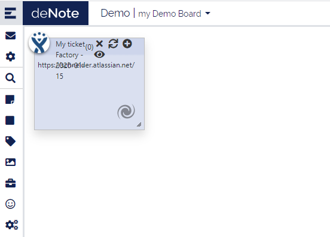

# Jira Factory configuration

Step 1 : build the list within jira :

 

Step 2 : click on advanced to have the request in rest mode :
 

Step 3 : Rebuilt the rest request to test it :

**https://edifixio.atlassian.net/** rest/api/2/search?jql=*project = DENOTE AND fixVersion = "1.0"*

* **in bold jira base url**
* in normal common api call
* *in italic api request taken in jira*

Step 4 : copy past the request in a web browser and check if we got a result

 

Step 6 : Create a jira factoty
With name the red value
And in rest request  the yellow and green part

 
 Use the Test button to validate your inputs

 Chose the color of the factory and the related stickies.

Then ok

Factory appears :
  

Step 7 : Resize and reposition it :
  
 
Step 8 : Put it on background an lock it

Step 9 : Refresh it