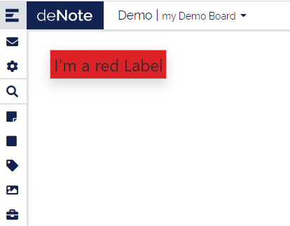
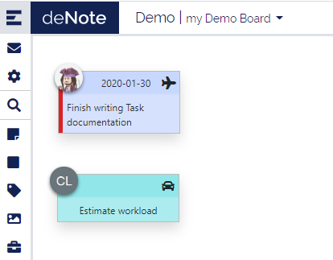
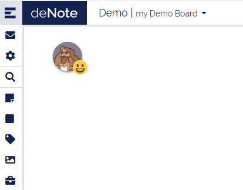
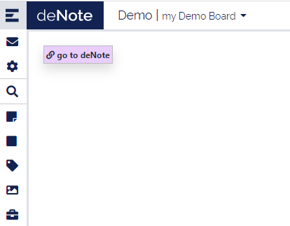

# Sticky types

## Sample Note
It is an element aims to represent a real-life post-It. User can set the background color, the text and a size. 

## Rectangle
It is just a shape representing a rectangle with a background color. No text can be added. You can set the width and height though.

Combined with the lock option it is usefull to define sector in a board.

## Label
Label is a text area. User can set the size of the text and the background color.

## Image
Single image that user can upload from his computer. 

## Task
A task is a work item assigned to a user. In deNote you can set a title, due date, priority, assignment, content and a background color. The content is displayed only when you open the detail popup.

## Mood
Mood sticky is a pictorial representation of the user’s mood. It displays the user’s logo with a smiley icon on the bottom right.

## Jira Factory
Jira factory allows user to query a Jira repository using a REST request. User must set the URL of the JIRA, a REST request and a login to connect to Jira. This will create a sticky on the board. To get or update tickets from JIRA, user must click on the refresh button . User’s connection token is required to connect to the JIRA and get the tickets. They pop over the factory sticky and can’t be updated. 

Besides, user can get a single jira-ticket by clicking button . 

User can temporary archive a ticket using a functionality called Warp zone. The warp zone is located at the bottom right corner with this image . To put a ticket into the warp zone, just move it over the image. It will disappear, but it is not removed until the factory is refreshed. To restore it and display it again on the board, you must search it using the search bar.

Check out our [Jira Factory configuration page](Jira-factory-configuration).

## Url Link

Url link sticky allow to create alink to another web page, leading to a redirection on click.
A tooltip is also available on it

## Notebook

This is a multi pager sticky, you can add entry by using *+* icone and move to older entries with the arrow

## Geolocation

This sticky display a map witht the location shared by users. If a user doesn't share his location an IP location estimation is done.

## Recognition

## Export to picture

## Leave Sticky
N/A

# Features

## Poker Planning

## Search (in factory)

