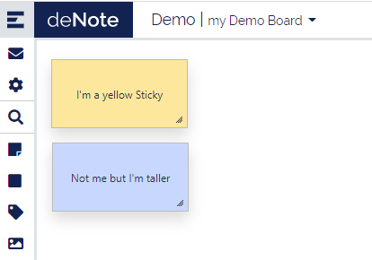
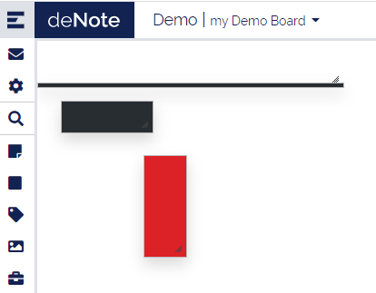
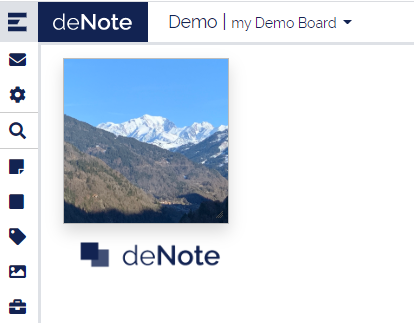
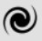
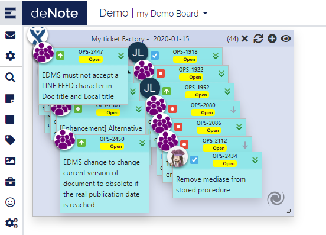
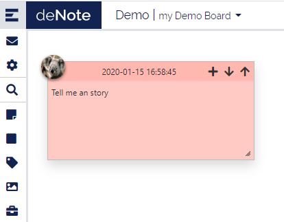
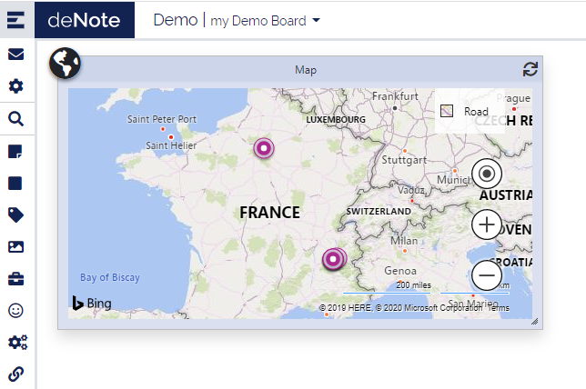
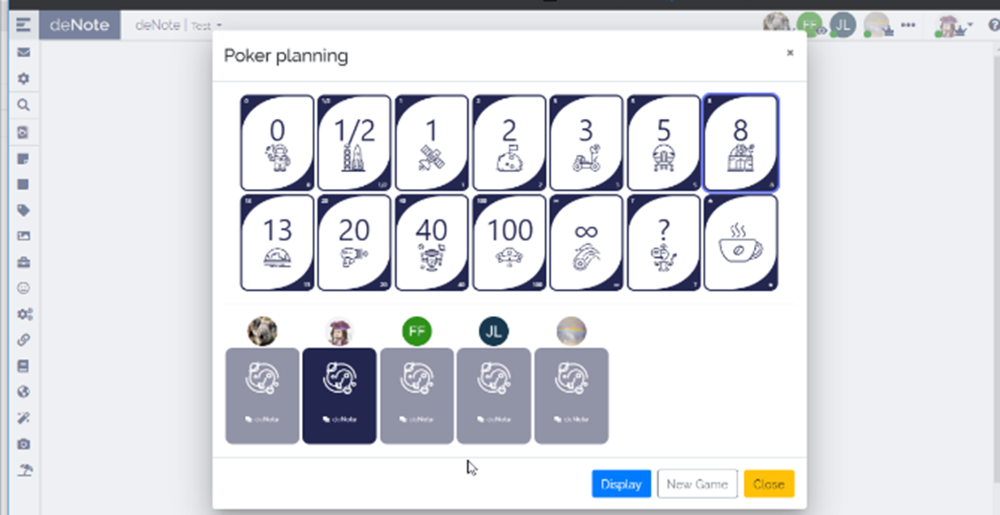

# Sticky types

## Simple Note
It's an element aims to represent a real-life post-It. You can set background color, text and size. 

## Rectangle
It is just a shape representing a rectangle with a background color. No text can be added. You can set the width and height though.

Combined with the lock option it is usefull to define areas in a board.

## Label
Label is a text area. You can set the size of the text and the background color.

## Image
Single image you can upload. 

## Task
A task is a work item assigned to a user. In deNote you can set a title, due date, priority, assignment, content and a background color. The content is displayed only when you open the detail popup.

## Mood
Mood sticky is a pictorial representation of user’s mood. It displays the user’s logo with a smiley icon on the bottom right.

## Jira Factory
Jira factory allows user to query a Jira repository using a REST request. You must set the URL of the JIRA, a REST request and a login to connect to Jira. This will create a sticky on the board. To get or update tickets from JIRA, you must click on the refresh button . Connection token is required to connect to the JIRA and get the tickets. They pop over the factory sticky and can’t be updated. 

Besides, you can get a single jira-ticket by clicking button . 

You can temporary archive a ticket using a functionality called Warp zone. The warp zone is located at the bottom right corner with this image . To put a ticket into the warp zone, just move it over the image. It will disappear, but it is not removed until the factory is refreshed. To restore it and display it again on the board, you must search it using the search bar.

Check out our [Jira Factory configuration page](Jira-factory-configuration).

## Url Link

Url link sticky allows to create a link to another web page, leading to a redirection on click.
A tooltip is also available on it.

## Notebook

This is a multi pager sticky, you can add entry by using *+* icon and move to an older entry with the arrows.

## Geolocation

This sticky display a map with the location shared by users. IP location estimation is done for users who don't shared their location.

## Recognition
For advanced members only

## Export to picture
In progess

## Leave Sticky
N/A

# Features

##  Poker Planning

As a part of methodology, you can use the poker planning to estimate the complexity of a task.

By clicking on the poker planning button, you will open a poker play for the current connected users.

Each user can choose his estimation, when all user have chosen, all card are dsplayed with the choosen values.

You can force the result by clicking on Display (even if some user haven't choose) 

##   Search (in factory)

.You can search a specific sticky using the search funcionnality.
Current version only allow search on jira key comming from the jira factory.
