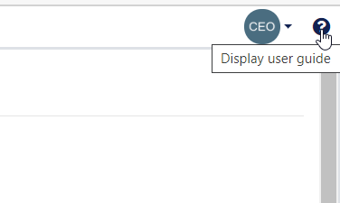
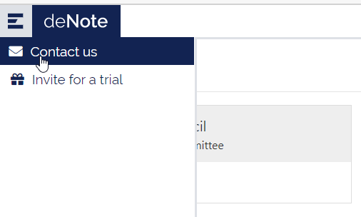

# Common Features

Once connected in denote, you join on the landing page.
In the first line ou have the last project you look on.

## Application navigation

You can directly go to the last board you see in a project by clicking on the project name.

You can also choose direclty the board ou want to connect within the projec drop down list.

## Edit profile

In the profil edit page you can:
* Update your display name
* Choose to recieve or not the news letters
* Edt your thumbnail image

## Help acces

You can access to the documentation with the link below.

The documentation is open source, feel free to contribue!

## Contact support team

## Invite someone to test the application

You can invite other people to test the application for free and for a limited period of time.

