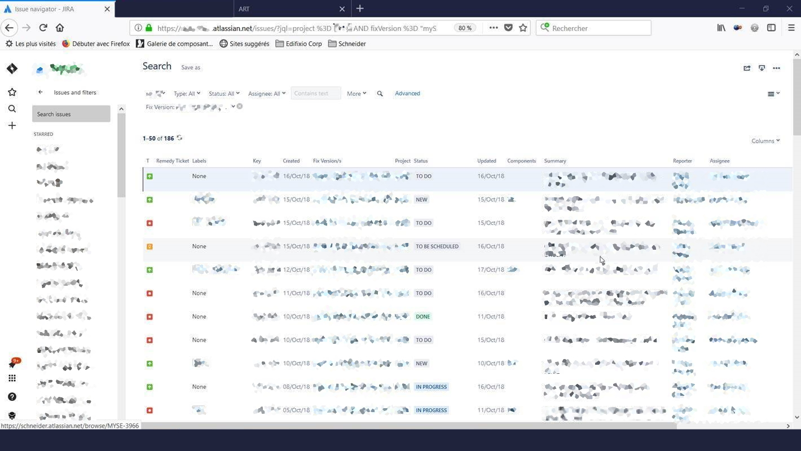
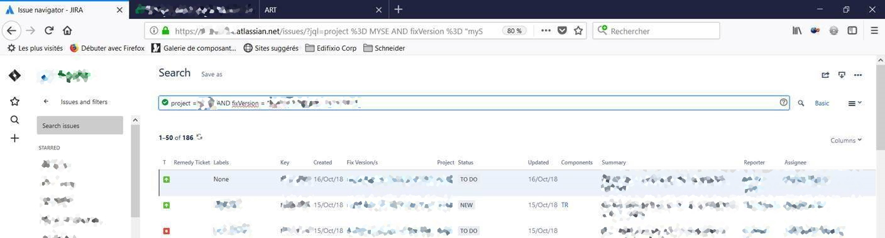
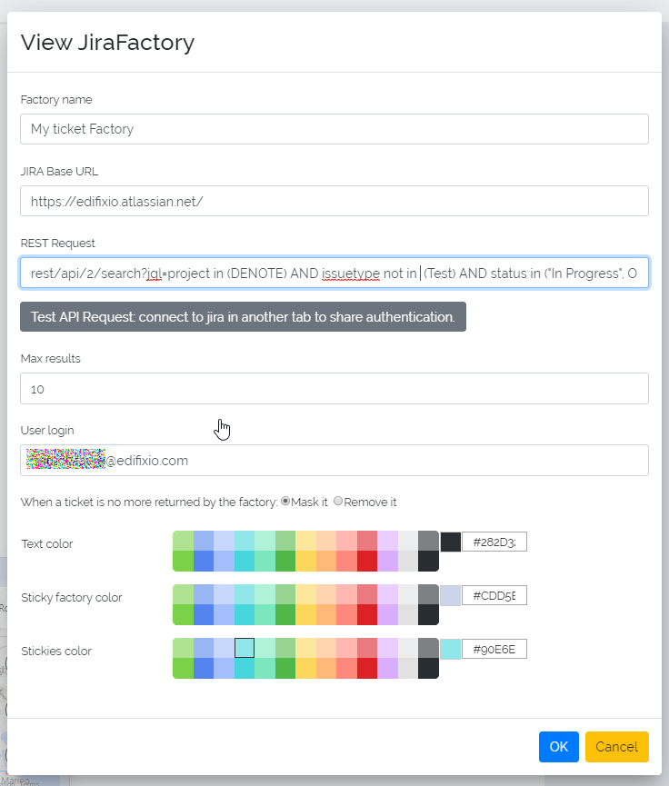

# Jira Factory configuration

Step 1: build the list in jira :

 

Step 2: click on advanced to have the request in rest mode :
 

Step 3: rebuild the rest request to test it :

**https://edifixio.atlassian.net/** rest/api/2/search?jql=*project = DENOTE AND fixVersion = "1.0"*

* **in bold jira base url**
* in normal common api call
* *in italic api request taken in jira*

Step 4: copy/paste the request in a web browser and check if you get a result

Step 5 (optional): check the full URL in a browser to validate the syntax

Step 6: create a jira factory. Put the bold part from step 3 into field `JIRA Base URL`. Concatenate the other two parts and put the result into field `REST Request`

Use the Test button to validate your inputs

Chose the color of the factory and the related stickies.

Then ok

Factory appears :

Step 7: resize and reposition it :

 
Step 8: put it in background an lock it

Step 9: refresh it
