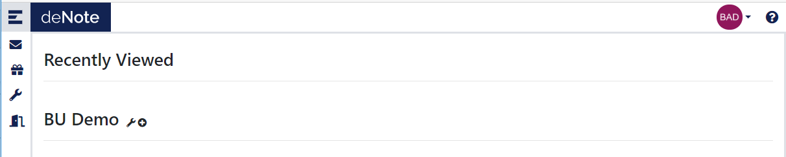
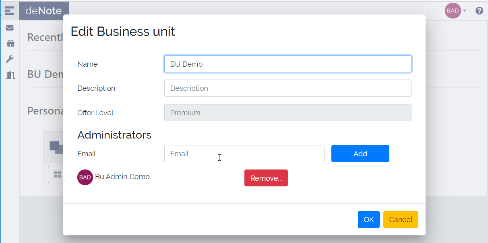
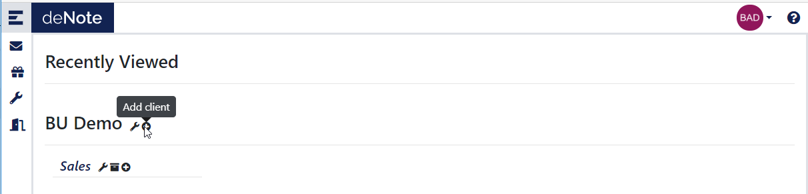
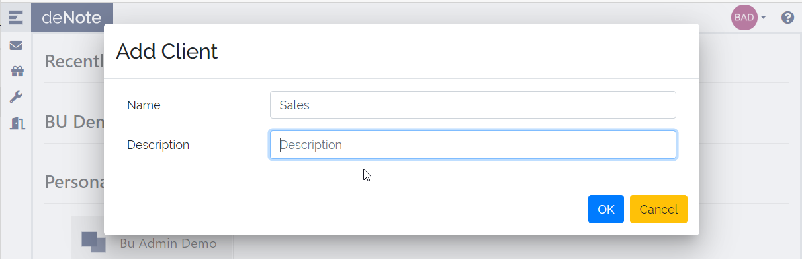
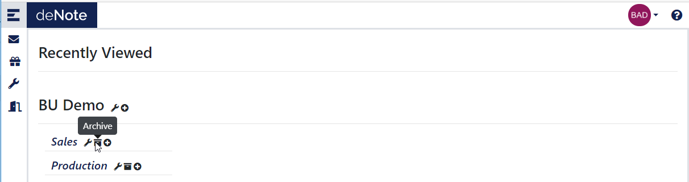
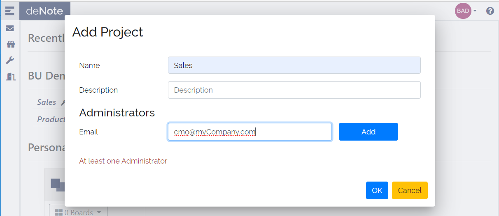
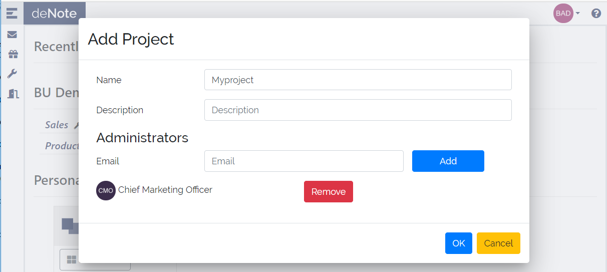
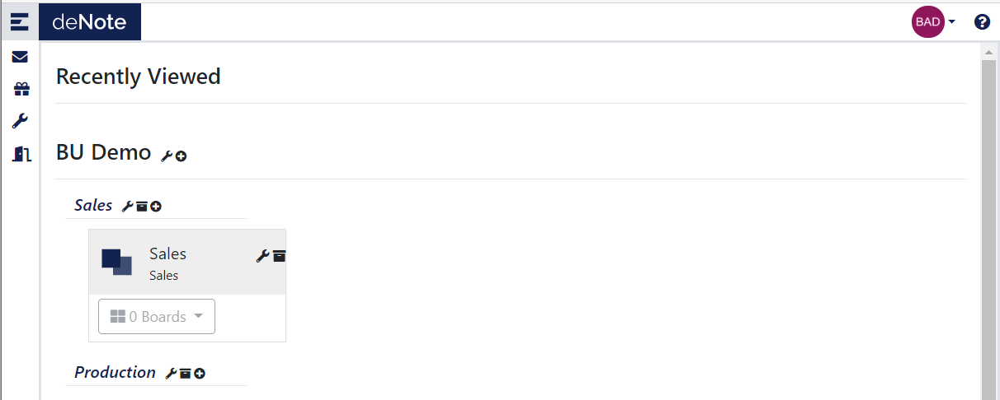

# First access to project as Billing Unit Admin

Once your account is created you are redirect to the deNote landing page.

As BU admin, you will see the BU that is empty.

.

You can Edit your Billing unit to add other BU admin.
You need to keep a minimum of 1 BU Admin.

.

The first step is to initialize the BU organisation, In deNote we calles this, client level, but it can be used t define part of your organisation.

Click on the *Add Client* icon

.

Set the name of the Client level and cick on *OK*

.

You can have as many client level as you need.

.

Now you can create your projecs in the client level you choose.

.

For each Project, you define a project admin, you can have more than one, with a minimum on 1.

If you do not set yourself as project admin, you will not have access to the content of the project

.

Once the project is created you will see it in the landing page.

.

