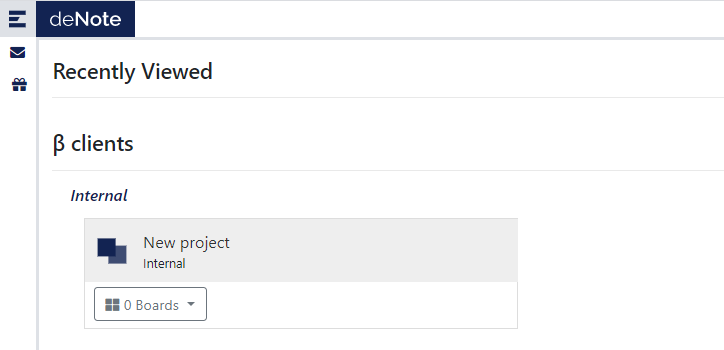
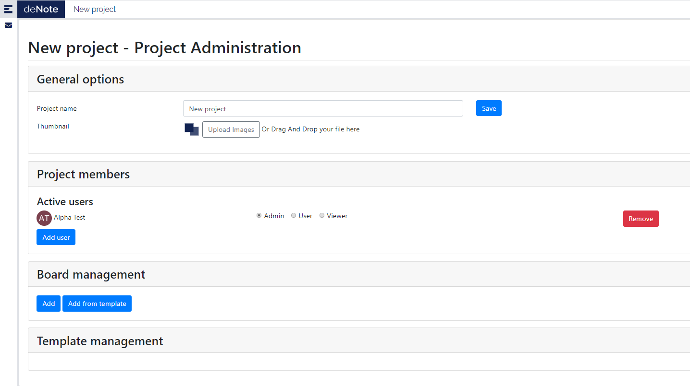
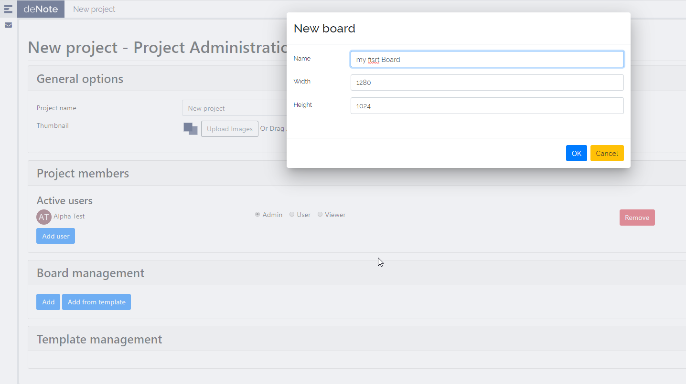
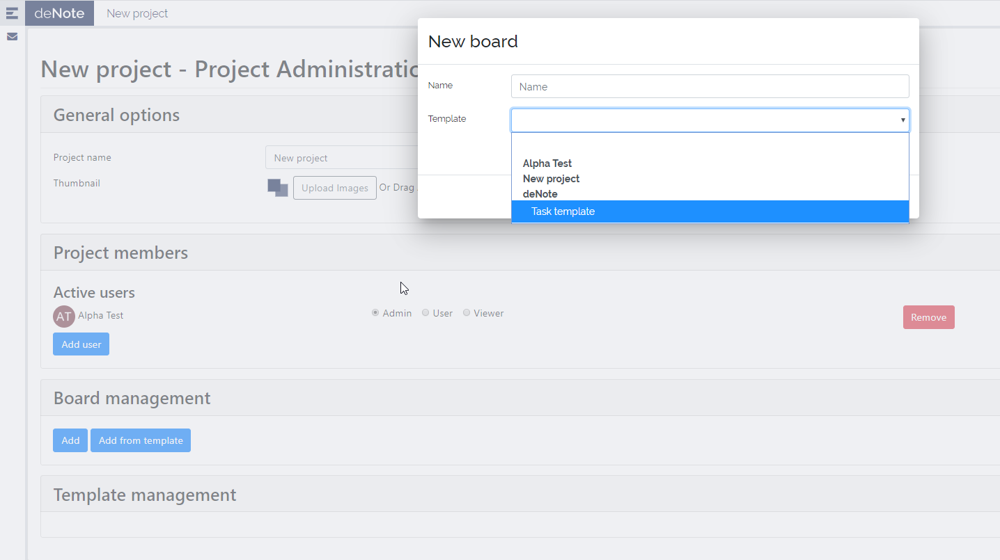

# First access to project as project Admin

Once your account is created, you can log in. You will jump to the landing page.

As you can see, no board are associated to the project.
The first step is to initialize the project.

Click on the project name. This will open the project admin page.

## Setup the project

* Choose the name of you project.
* Choose the picture associated to your project.
* You can add people you want to share your project with, (using their email address)

## Add Boards
You must add at least one board.

* click on **Add** button to define the name and the size of the board.

* click on **Add from template** button to ceate a board from a template.

* Once boards are created, you can jump into and modify them. Remember to lock the stickies you want to use as board design.

You can change the orders of the board at any time in the project administration page.