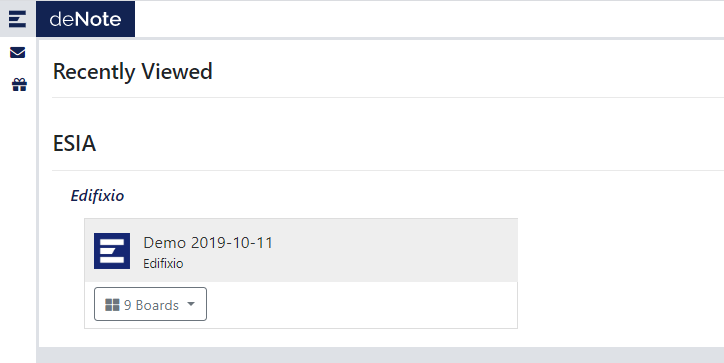
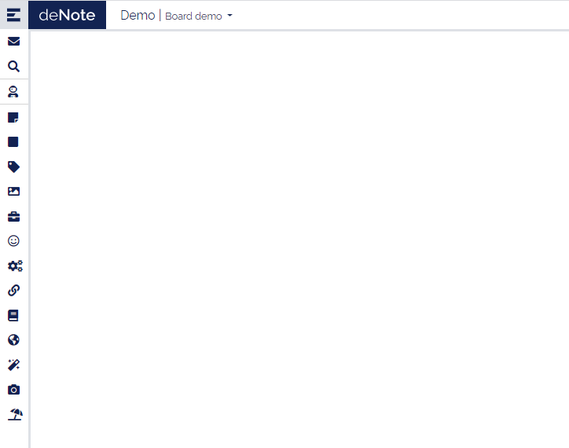

---
# First access to project as User
---

Once your account is created, you can log in. You will jump to the landing page.

You see in this page the projects you've been assigned to. You can jump into the board by clicking on it or by selecting directly the boad in the drop-down list.

Once selected it you will be connected to it

You can now use the deNote and create/update stickies.