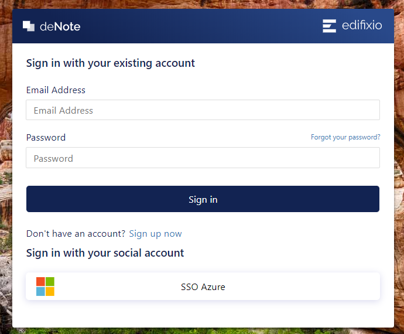

# User Creation

Create your account using the link in the email you recieve.

Click on **Sign Up now**

* Enter the email you've been invited with.
* Click on send verification code
* Enter the verification code you recieve by email the pop up, set up and cofirm your password.

* Choose the Display Name is the name that will be displayed in deNote.

* Click on create

You can update your personal information later in Edit profile page.