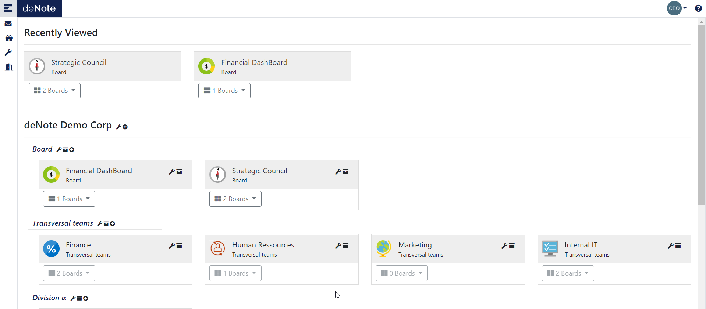

---
# Organization
---

## Billing Unit

The highest level subdivision, this level is associated with the facturation. 
Billing unit admin can organize the project within they scope creating client level and project level.

## Client 

A Classification division of project, this is a node level to be able to regroup projects by client or any another administrative division

## Project

Project level is the main user centric point of entry. for each project you can define, users with role level, create and manage boards related to your project

## Boards
In each project you can have one or many boards. A board is basically a virtual representation of a white board.

Each user associated with a project can see and contribute to a board (regarding his access level), by creating moving, updating [stickies](sticky-types)

